## Chat Application UI

### Uses In this Project

HTML, CSS, JS, Bootstarp 5,

Almost Responsive,

#### Pages

**Login**

    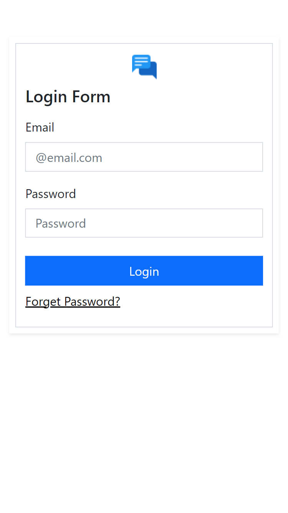

    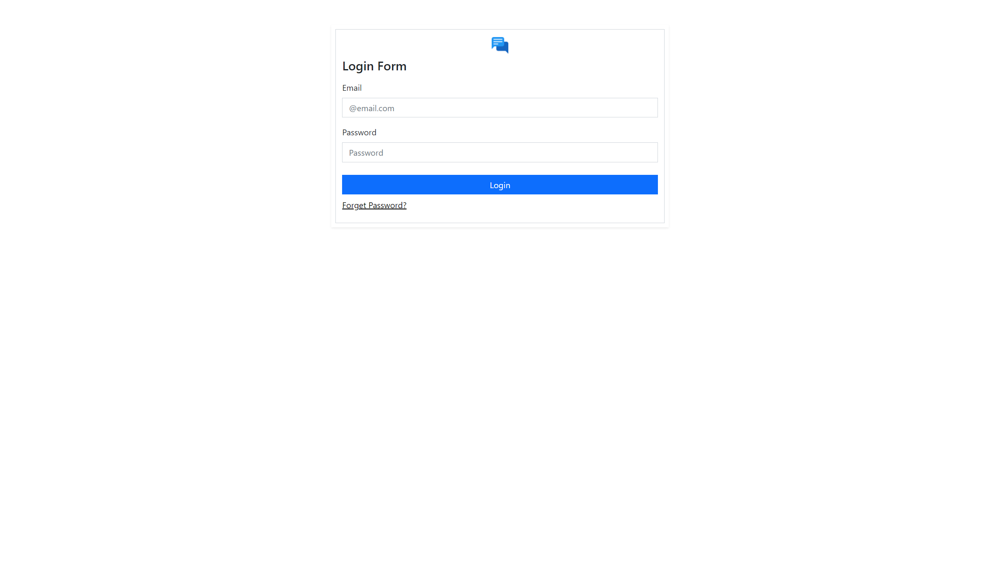

---

**Register**

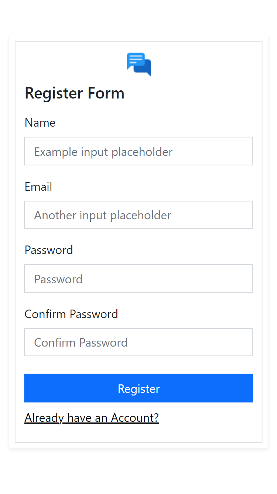

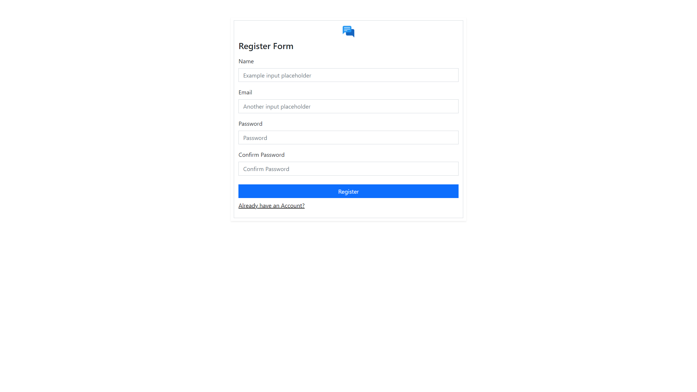

---

**Main**

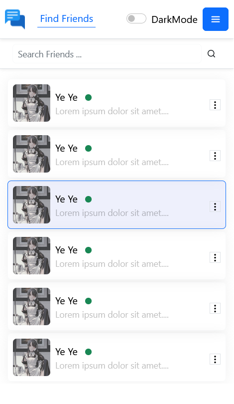

---

**Chat Display Box**

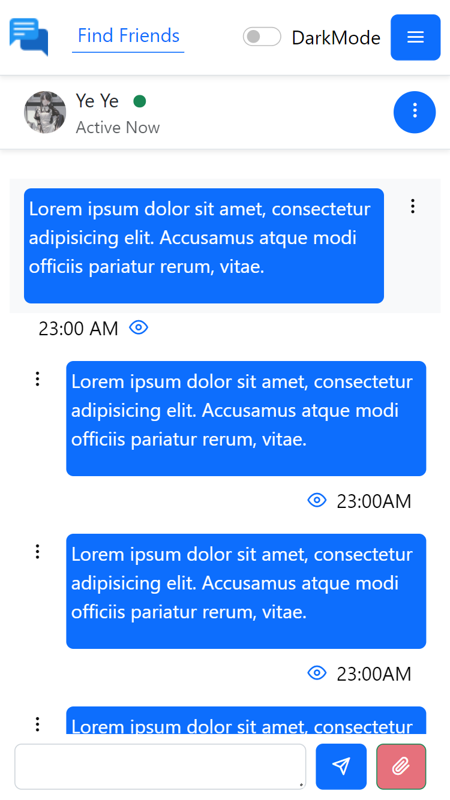

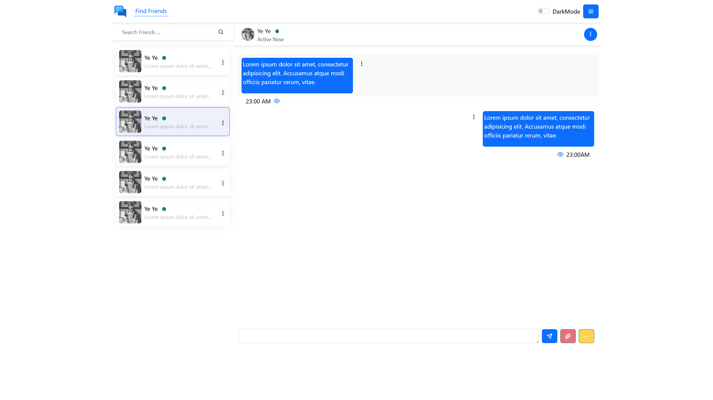

---

**Friend**

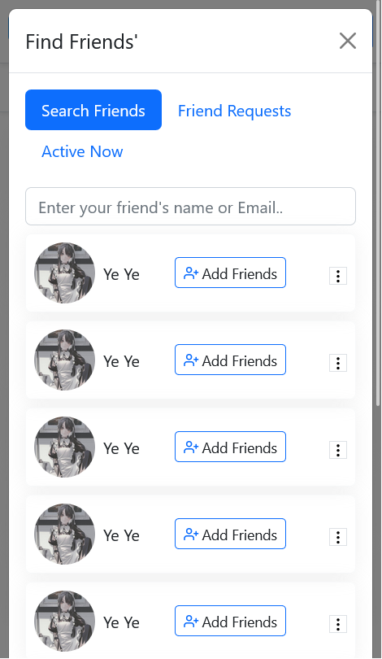

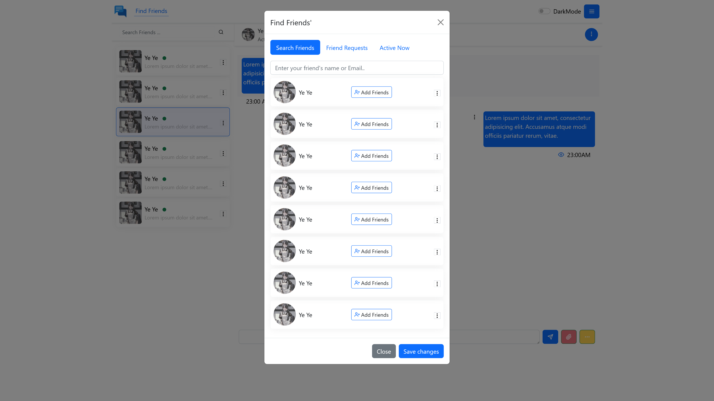

---

**Profile**

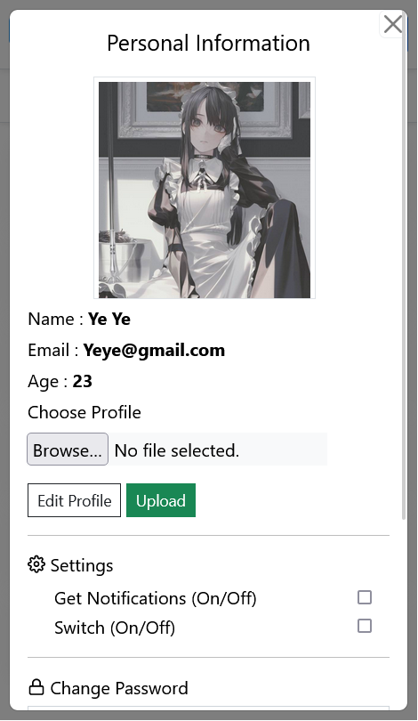

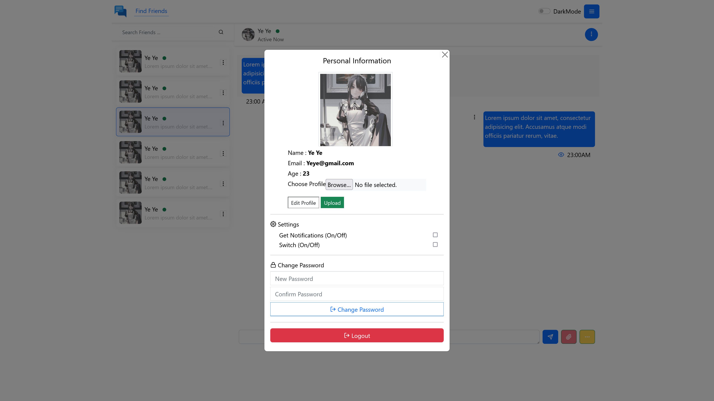

---
